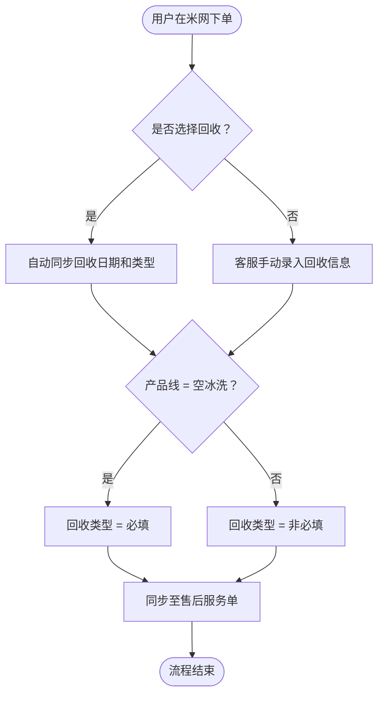
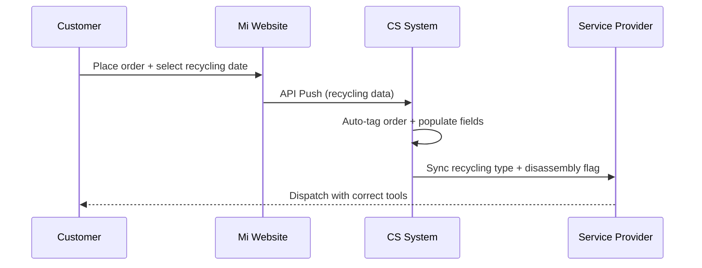
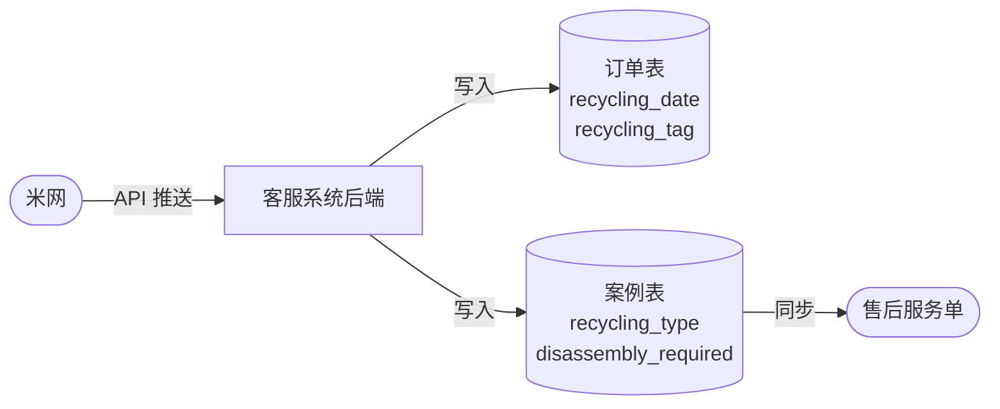
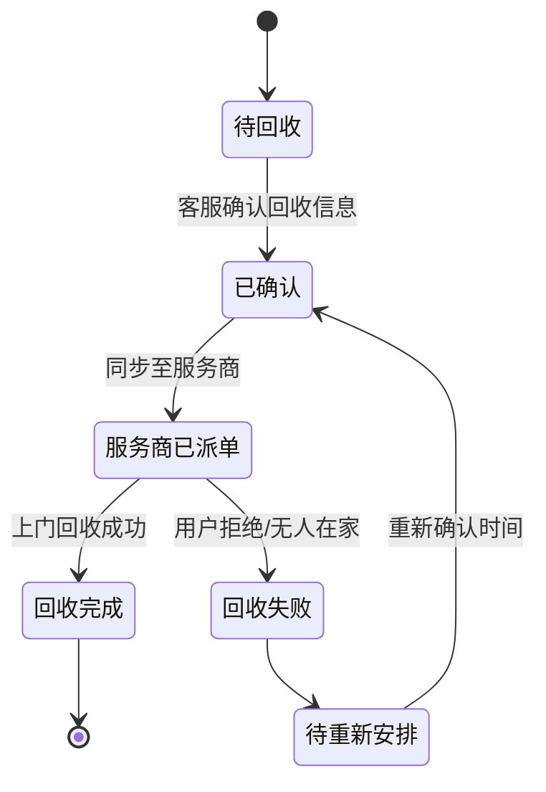
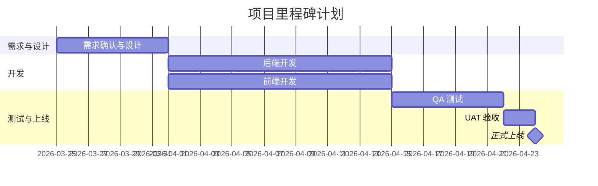

## What I do
I transform a Business Requirement Document (BRD) into a fully structured Product Requirement Document (PRD) following your organization's "Golden Template". I also **auto-detect complex logic** in the BRD and generate **workflow diagrams** to make requirements visually clear for all teams (Dev, QA, Business).

---

## Language Rule (CRITICAL — Must Follow)

> **The PRD output language MUST match the BRD input language. Always.**

*   If the BRD is written in **Chinese (中文)** → Generate the entire PRD in **Chinese**.
*   If the BRD is written in **English** → Generate the entire PRD in **English**.
*   If the BRD is written in **any other language** (Japanese, French, Arabic, Hindi, etc.) → Generate the entire PRD in **that same language**.
*   If the BRD is **mixed language** (e.g., Chinese body with English field names) → Use the **dominant language** for all prose, and preserve technical terms (field names, API names, system names) in their original language.

**Detection Method:** Identify the language by reading the BRD body text (not headers or labels). The language of the majority of the body content determines the output language.

**This rule overrides all other defaults. No exceptions.**

---

## Workflow Diagram Rule (CRITICAL — Must Follow)

> **Whenever the BRD contains complex logic, generate a Mermaid diagram automatically.**

### When to Generate a Diagram

Scan the BRD for the following triggers and generate the appropriate diagram type:

| Trigger in BRD | Diagram Type | Mermaid Syntax |
| :--- | :--- | :--- |
| IF/ELSE conditions, case statements, branching logic | Decision Flow | `flowchart TD` |
| Step-by-step processes, multi-step operations | Process Flow | `flowchart TD` |
| Multiple actors/systems interacting (e.g., User → System → Service Provider) | Sequence Diagram | `sequenceDiagram` |
| Object/order status transitions (e.g., Pending → Processing → Done) | State Diagram | `stateDiagram-v2` |
| Project phases, timeline, delivery schedule | Gantt Chart | `gantt` |
| Data sync between systems (e.g., Mi Website → CS System → After-Sales) | Data Flow | `flowchart LR` |

### Diagram Placement Rules

*   **Section 01 Background:** Add a "Current Process Flow" diagram showing the AS-IS (existing broken/manual process).
*   **Section 03 Features:** Add a "New Logic Flow" diagram for each complex feature showing IF/ELSE/case decision trees.
*   **Section 04 User Experience:** Add a "User Journey" sequence diagram showing the end-to-end interaction between user, system, and service provider.
*   **Section 06 Technical Requirements:** Add a "System Architecture / Data Flow" diagram showing how data moves between systems.

### Diagram Generation Rules

1.  **Always label nodes clearly** in the detected language (Chinese nodes for Chinese BRDs, English for English BRDs).
2.  **Decision nodes** (diamonds) must show both YES and NO paths — never leave a branch incomplete.
3.  **Color coding** (where supported):
    *   Start/End nodes: rounded rectangles `([text])`
    *   Decision nodes: diamond `{text}`
    *   Process nodes: rectangle `[text]`
    *   External systems: stadium shape `([text])`
4.  **Keep diagrams focused** — one diagram per logical flow. Do not combine unrelated flows into one diagram.
5.  **Add a caption** above each diagram explaining what it shows.

### Example Diagrams

#### Example 1 — IF/ELSE Decision Flow (Chinese)


#### Example 2 — Multi-Actor Sequence Diagram (English)


#### Example 3 — System Data Flow (Left to Right)


#### Example 4 — State Diagram


#### Example 5 — Gantt Chart


---

## Full Workflow

1.  **Read BRD:** Fetch the content of the provided Feishu Doc URL using `feishu-mcp_fetch-doc`.
2.  **Detect Language:** Identify the dominant language from BRD body text.
3.  **Scan for Complex Logic:** Identify all IF/ELSE conditions, multi-actor flows, status transitions, and data sync paths.
4.  **Plan Diagrams:** Decide which diagram types to generate for each detected logic pattern.
5.  **Structure Content:** Map BRD into the 6 mandatory PRD sections in the detected language.
6.  **Embed Diagrams:** Insert Mermaid diagrams at the correct section positions.
7.  **Add Meta-Data:** Prepend "Demand Doc" & "Key Persons" tables. Append "High Risk Element Review" table.
8.  **Create PRD:** Generate a new Feishu Doc in My Library.
9.  **Return Link:** Provide the Feishu Doc URL to the user.

---

## Golden Template Structure (with Diagram Positions)

```
[Header]
  - BRD 需求文档 / BRD Demand Doc
  - 需求相关负责人 / Demand Related Key Persons Table

[Body]
  01 背景 / Background
      → 📊 Diagram: AS-IS Current Process Flow (flowchart)

  02 目标 / Objectives
      (SMART Goals, KPIs, Risk Mitigation)

  03 功能需求 / Features
      → 📊 Diagram: Feature Logic Flow per complex feature (flowchart with IF/ELSE)

  04 用户体验 / User Experience
      → 📊 Diagram: User Journey (sequenceDiagram)

  05 里程碑 / Milestones
      → 📊 Diagram: Project Timeline (gantt)

  06 技术要求 / Technical Requirements
      → 📊 Diagram: System Data Flow (flowchart LR)
      → 📊 Diagram: State Transitions if applicable (stateDiagram-v2)

[Footer]
  - 高风险要素审查 / High Risk Element Review
```

---

## Section Name Translation Reference

| English | Chinese |
| :--- | :--- |
| BRD Demand Doc | BRD 需求文档 |
| Initiated By | 提出人 |
| Demand Related Key Persons | 需求相关负责人 |
| Department | 部门 |
| Related Person | 负责人 |
| Remark | 备注 |
| Background | 背景 |
| Context | 背景介绍 |
| Problem Statement | 问题陈述 |
| Market Opportunity | 市场机会 |
| User Personas | 用户画像 |
| Vision Statement | 愿景 |
| Objectives | 目标 |
| SMART Goals | SMART 目标 |
| KPIs | 关键绩效指标 |
| Risk Mitigation | 风险应对 |
| Features | 功能需求 |
| Core Features | 核心功能 |
| User Benefits | 用户价值 |
| Technical Specifications | 技术说明 |
| Feature Prioritization | 功能优先级 |
| User Experience | 用户体验 |
| UI Design | 界面设计 |
| User Journey | 用户旅程 |
| Usability Testing | 可用性测试 |
| Milestones | 里程碑 |
| Development Phases | 开发阶段 |
| Critical Path | 关键路径 |
| Launch Plan | 发布计划 |
| Technical Requirements | 技术要求 |
| Tech Stack | 技术栈 |
| System Architecture | 系统架构 |
| Security Measures | 安全措施 |
| Integration Requirements | 集成需求 |
| High Risk Element Review | 高风险要素审查 |
| High Risk Items | 高风险项目 |
| Does it involve private fields? | 是否涉及隐私字段？ |

---

## Quality Checklist (Before Creating Feishu Doc)

- [ ] Language detected correctly from BRD body text.
- [ ] All section headings are in the correct language.
- [ ] All prose, descriptions, and analysis are in the correct language.
- [ ] Technical terms (API names, field names, system names) preserved as-is.
- [ ] No section skipped. Missing info marked as `[TBD]` in the correct language.
- [ ] All complex IF/ELSE logic has a corresponding Mermaid flowchart.
- [ ] All multi-actor interactions have a sequence diagram.
- [ ] Section 06 has a system data flow diagram.
- [ ] Section 05 has a Gantt chart if timeline is provided.
- [ ] All diagram nodes are labeled in the correct language.
- [ ] High Risk Review accurately reflects content (not always "No" — assess the actual BRD).
