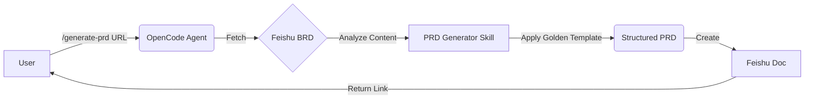

# 🚀 PRD Generator Skill for OpenCode


A powerful **OpenCode Skill** that automates the creation of comprehensive **Product Requirement Documents (PRDs)** from **Business Requirement Documents (BRDs)**. 

It strictly enforces a "Golden Template" structure to ensure every PRD is developer-ready, consistent, and professional.

---

## 📖 How It Works



## ✨ Key Features

*   **Automated Structuring:** Instantly maps raw BRD content into a standardized 6-section PRD.
*   **Golden Template Compliance:** Enforces the mandatory organization structure:
    1.  **Background** (Problem, Context, Personas)
    2.  **Objectives** (SMART Goals, KPIs)
    3.  **Features** (Core, Tech Specs, MoSCoW)
    4.  **User Experience** (UI, Journey)
    5.  **Milestones** (Phases, Launch Plan)
    6.  **Technical Requirements** (Stack, Security)
*   **Metadata Management:** Automatically adds "Demand Doc", "Key Persons", and "High Risk Review" tables.
*   **Rich Formatting:** Generates Feishu Docs with native callouts, tables, and grids.

---

## 📦 Installation

### Option A: Clone Repository (Recommended)
Clone this repository directly into your OpenCode workspace:

```bash
git clone https://github.com/nandanosql/prd_generator_skill.git
```

### Option B: Manual Setup
Copy the `.opencode` folder and `opencode.json` into your project root.

---

## 🛠️ Usage

Once installed, simply use the slash command in your OpenCode chat:

```bash
/generate-prd <BRD_Feishu_URL>
```

### Example
```bash
/generate-prd https://feishu.cn/wiki/wikcnP4Z8X...
```

**What happens next?**
1.  The agent reads your BRD.
2.  It analyzes the requirements.
3.  It generates a new Feishu Doc in your library titled `PRD | [Project Name]`.
4.  It returns the link to the new document.

---

## ⚙️ Configuration

The `opencode.json` file controls the skill's behavior and permissions.

```json
{
  "agent": {
    "default": {
      "model": "anthropic/claude-3-5-sonnet-20241022",
      "temperature": 0.5
    }
  },
  "permission": {
    "tool": {
      "feishu-mcp_*": "allow"
    }
  }
}
```

*   **Model:** We recommend `claude-3-5-sonnet` for the best document generation quality.
*   **Permissions:** Ensure `feishu-mcp_*` tools are allowed.

---

## 📂 Project Structure

```
.
├── .opencode/
│   ├── skills/
│   │   └── prd-generator/
│   │       └── SKILL.md       # 🧠 The core logic & template
│   └── commands/
│       └── generate-prd.md    # ⚡ The slash command trigger
├── opencode.json              # 🔧 Configuration file
└── README.md                  # 📖 This documentation
```

## 📄 License

MIT License. Created by **Nandan Priyadarshi**.
